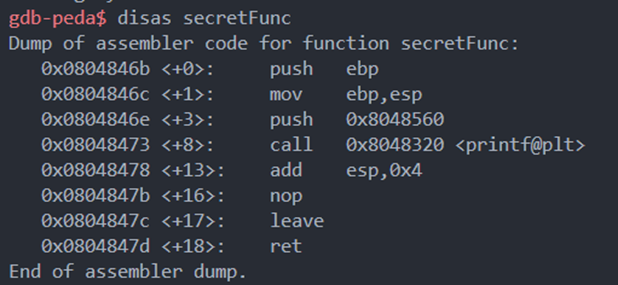

> 22110085_Nguyen Truong

<b>Lab 1</b>

___

### Bof 1:

> Purpose of this practice: Exploit the vulneability of gets to change the
> return address of vuln() function into secretFunc() address

Here is the stack frame of the main function:

We can see that to override the Vuln() return address function, we need to pass 204 bytes then the
address of secretFunc() which is:0x0804846b

> Running file and passing value to array[200]:
>

>==> Finished
___

### Bof 2

> Purpose of this practice : Exploit the vulneability in fgets() to
> override the value of check variable,
> so that it can print "Yeah! You Win" message

Let see the stack frame of this main function: 

To be able to override the value at Check variable, we have 
to pass a least 40 bytes + value for Check.

First if it pass 44 bytes to the terminal run but the address 
for check var is different to 0xdeadbeef
than i do not get the purpose yet

Only when i pass the DeadBeef var than i can finish to print 
the goal message: 

>==> Finished
___
## Bof3 :

> Purpose: Override the Func() variable's address to the Shell() function

Let's take a brief look at Stack Frame of this main: 

Currently, Func is a pointer which is pointing to Sup() address
So to override and change this pointer to Shell() address we have to
find the address of shell function: 

After knowing the Shell function() address (0x0804845b)
Than we run the file and pass 128 bytes plus Shell address

>==> Finished

